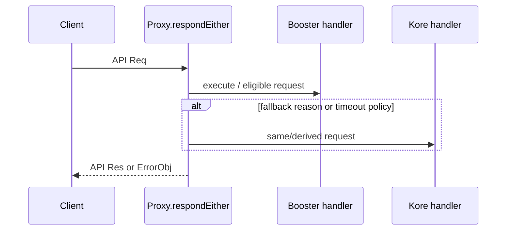

# 执行流

## 1. 启动（Confirmed）

`kore/app/rpc/Main.hs:main` 解析选项；`koreRpcServerRun` 反序列化 definition、加载
definitions，构造 `ServerState`，再调用 `Kore.JsonRpc.runServer`。它把 `runSMT` 注入
handler；该 runner 用 `SMT.newSolver`、`declareSMTLemmas`、`SMT.initSolver` 和
`SMT.runWithSolver` 包围一次查询。

Booster `Server.hs:main` 读取 `KORE_RPC_OPTS`/CLI，加载 definition，选择性调用
`withMDLib`/`mkAPI`，建立 Kore 与 Booster state 后注册 Proxy。

## 2. RPC dispatch 与 execute（Confirmed）

`Proxy.respondEither` 对 `Execute` 先读取 `boosterState` 并进入 `handleExecute`；带
`stepTimeout` 的请求直接走 Kore。对 `Implies`、`Simplify`、`AddModule`、`GetModel`
各有显式分支，不能把 import 当成调用证据。

在旧路径中 `Kore.JsonRpc.respond` 的 `Execute` 分支先 `verifyIn`，验证失败返回
`CouldNotVerifyPattern` 的 `backendError`；成功时把已验证 pattern 交给
`Exec.rpcExec`，再把 `GraphTraversal.TraversalResult` 转成 `ExecuteResult`。相关测试：
`test/rpc-server/execute/`。

## 3. 化简、规则与 SMT

**Confirmed**：`Kore.JsonRpc.respond` 的 `Simplify` 分支调用 `evalSimplifier`；
`Kore.Exec.rpcExec` 是 RPC execute 的执行入口。Booster 有 `Pattern.Util`、
`Pattern.Rewrite` 和 `RewriteResult` 类型。`Proxy.respondEither` 对 `Simplify` 有独立
分支；其具体双引擎组合必须按该函数当前实现复核。

**Inferred**：规则匹配/应用的内部步骤主要由 `Booster.Pattern.Rewrite` 或 Kore rewrite
模块完成，pattern/condition 在其中被构造与消费；详见[数据模型](data-model.md)。
SMT 查询经注入的 runner 委托 solver，solver 失败如何映射为每个 API result 需以特定
handler 分支和 `test/rpc-server/simplify/smt-error/` 复核。

## 4. 错误与日志（Confirmed）

Kore handler 返回 `Either ErrorObj (API 'Res)`；`verifyIn` 失败在 dispatch 层转成
`backendError`。Proxy 的 `withHaskellLoggingCapture` 在 request 指定 logging 时安装
Booster/Kore capture，`injectHaskellLogEntries` 将结果写回各 response variant。
