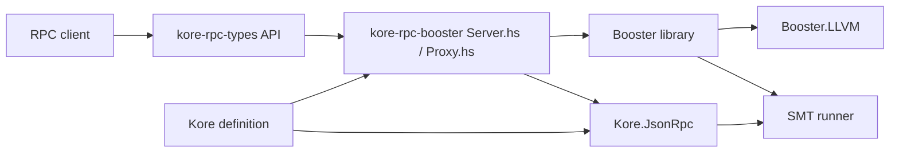

# 系统概览

## 位置与边界

**Confirmed**：`kore/kore.cabal` 构建 `kore-exec`、`kore-rpc`、`kore-repl` 和 `kore`
library；`booster/hs-backend-booster.cabal` 构建 `kore-rpc-booster`、`kore-rpc-client`
及 Booster library；`kore-rpc-types` 是独立 library。`kore/app/rpc/Main.hs` 把已加载
definition、主 module 和 SMT runner 交给 `Kore.JsonRpc.runServer`。Booster 的
`tools/booster/Server.hs` 同时初始化 Booster 与 Kore，再以 `Proxy.respondEither` 路由。

输入是 Kore definition、CLI 配置和 JSON-RPC 的 `KorePattern`；输出是 JSON-RPC API result、
日志以及（在配置下）SMT/LLVM 交互。K 产生/消费 definition 的具体编译过程不在此仓库中。

图中 `Proxy → Fast/Legacy` 由 `Proxy.respondEither` 的 request 分支证实；`Legacy → SMT`
由 `app/rpc/Main.hs:runSMT` 和 `Kore.JsonRpc.respond` 证实；`Fast → LLVM` 由
`tools/booster/Server.hs` 对 `withMDLib`/`mkAPI` 的调用证实。

## 运行模式与外部依赖

**Confirmed**：旧 Kore RPC server 是单引擎路径；`kore-rpc-booster` 是 proxy 路径。
`kore-rpc-types/src/Kore/JsonRpc/Types.hs` 定义 `Execute`、`Implies`、`Simplify`、
`AddModule`、`GetModel` API GADT。`booster/test/rpc-integration/` 和 `test/rpc-server/`
提供集成测试；`booster` 另有 LLVM、predicate 和 unit test-suite。

**Inferred**：K 是 definition 的上游生产者；pyk 是可能的外部客户端/工具生态。当前
revision 的 Haskell 源码未提供足以证明 pyk 直接调用的引用，故不把它画成运行时边。
参见[组件地图](component-map.md)和[执行流](execution-flow.md)。
